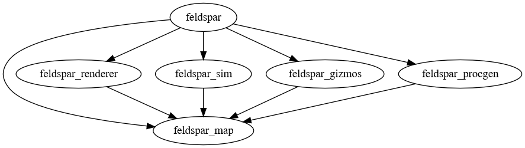

# feldspar

Procedural voxel worlds for Bevy Engine.

**Currently a work in progress!**

## Scope

This is not intended to be a highly generic voxel library. Namely it does not intend to support generic voxel data types.
Rather it has an opinionated data model to achieve specific goals like:

- [SDF](https://en.wikipedia.org/wiki/Signed_distance_function)-based terrain for:
  - [CSG (constructive solid geometry)](https://en.wikipedia.org/wiki/Constructive_solid_geometry)
  - noise-based procedural generation
- real-time responsive terraforming
- LOD (level of detail) via chunk downsampling
- biplanar texture mapping and material blending

## Project Structure

### Contributing

Please see [CONTRIBUTING.md](https://github.com/bonsairobo/feldspar/blob/main/CONTRIBUTING.md).

### Crates

- `feldspar`: the top-level crate that only contains executable targets like the map editor
- `feldspar-map`: the map data model and operational Bevy plugin
  - streams map data from a database into the scene
  - performs voxel and octree queries
  - persists edits to a versioned database
- `feldspar-sim`: a Bevy schedule that runs an RPG-like discrete time simulation in an isolated ECS world
- `feldspar-procgen`: algorithms for procedurally generating maps
- `feldspar-renderer`: a Bevy plugin that renders the currently loaded map
- `feldspar-gizmos`: Bevy plugins that allow GUI interaction with the scene

### Dependencies

This project has spawned several fundamental data structures and algorithms that are exposed as their own crates.

- [ilattice](https://github.com/bonsairobo/ilattice-rs)
- [ndshape](https://github.com/bonsairobo/ndshape-rs)
- [ndcopy](https://github.com/bonsairobo/ndcopy-rs)
- [fast-surface-nets](https://github.com/bonsairobo/fast-surface-nets-rs)
- [block-mesh](https://github.com/bonsairobo/block-mesh-rs)
- [height-mesh](https://github.com/bonsairobo/height-mesh-rs)
- [grid-tree](https://github.com/bonsairobo/grid-tree-rs)
- [grid-ray](https://github.com/bonsairobo/grid-ray-rs)
